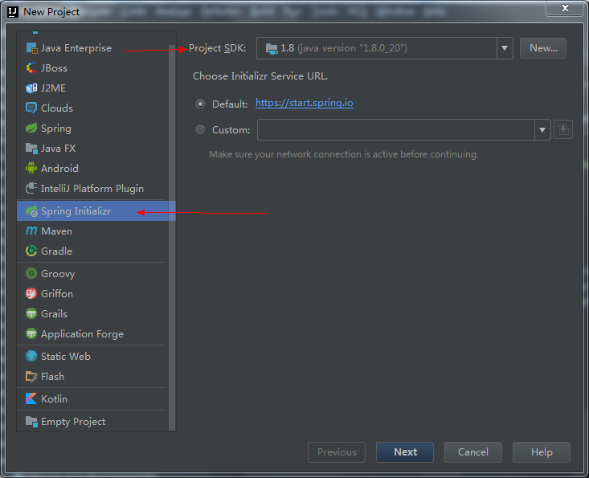
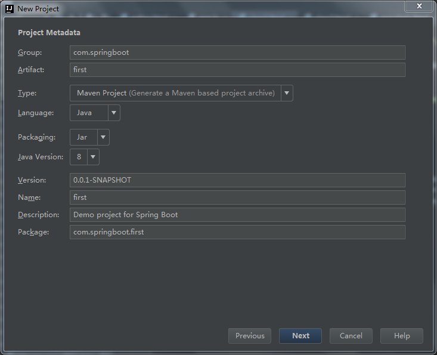
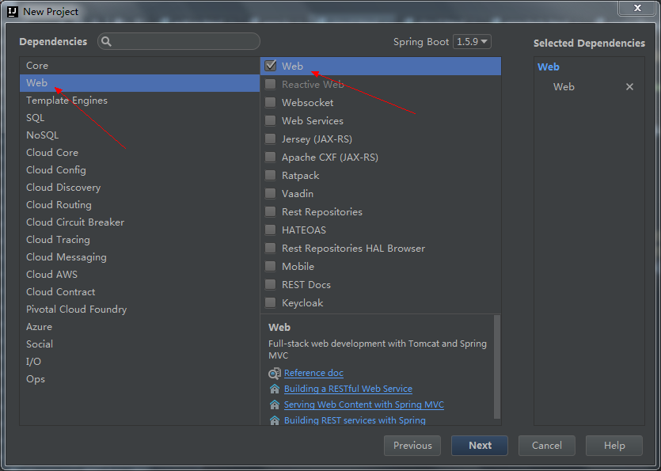
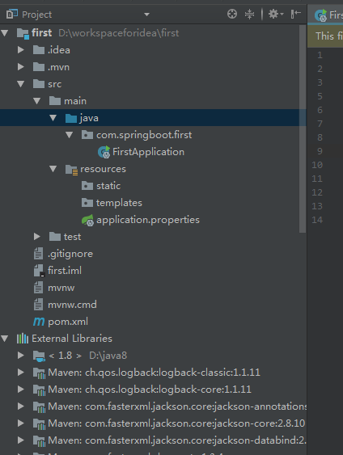
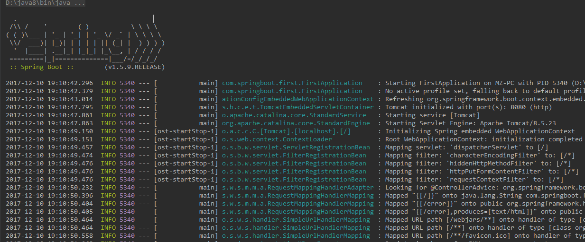

# 1. 新建Spring Initializr 项目



# 2. 填写项目信息



# 3. 选择项目使用的技术



# 4. 填写项目名称


# 5. 项目架构及依赖



# 6. 添加测试控制器

直接在入口类中编写。

```java
package com.springboot.first;

import org.springframework.boot.SpringApplication;
import org.springframework.boot.autoconfigure.SpringBootApplication;
import org.springframework.web.bind.annotation.RequestMapping;
import org.springframework.web.bind.annotation.RestController;

@RestController
@SpringBootApplication
public class FirstApplication {

    @RequestMapping("/")
    String index() {
        return "Hello Spring Boot";
    }
    public static void main(String[] args) {
        SpringApplication.run(FirstApplication.class, args);
    }
}
```

@SpringBootApplication是Spring Boot 项目的核心注解，主要目的是开启自动配置。main方法是一个标准的Java应用的main方法，主要作用是作为项目启动的入口。

# 7. 运行项目

把它当成一个java类运行就可以了，右键菜单中选择，如图：


运行信息：


8. 运行结果，如图：

