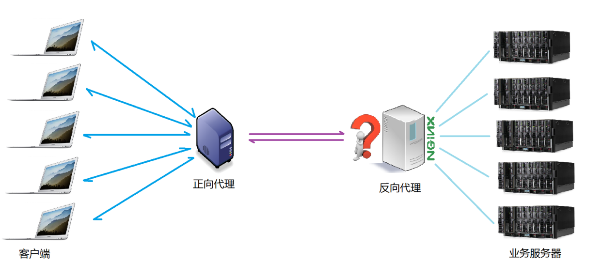

> 整理人：GuoFu
>
> 整理时间：2018年4月26日

-----------

# Nginx

> 反向代理，即代理将来自外网client的请求forward到内网server，**从外到内**
>
> 正向代理代理客户端，反向代理代理服务器
>

# 反向代理的实现


> 1）需要有一个负载均衡设备来分发用户请求，将用户请求分发到空闲的服务器上
>
> 2）服务器返回自己的服务到负载均衡设备
>
> 3）负载均衡将服务器的服务返回用户

即：用户和负载均衡设备直接通信，也意味着**用户做服务器域名解析时，解析得到的IP其实是负载均衡的IP，而不是服务器的IP**，这样有一个好处是，当新加入/移走服务器时，仅仅需要修改负载均衡的服务器列表，而不会影响现有的服务。


-----

**正向代理**

A同学在大众创业、万众创新的大时代背景下开启他的创业之路，目前他遇到的最大的一个问题就是启动资金，于是他决定去找马云爸爸借钱，可想而知，最后碰一鼻子灰回来了，情急之下，他想到一个办法，找关系开后门，经过一番消息打探，原来A同学的大学老师王老师是马云的同学，于是A同学找到王老师，托王老师帮忙去马云那借500万过来，当然最后事成了。不过马云并不知道这钱是A同学借的，马云是借给王老师的，最后由王老师转交给A同学。这里的王老师在这个过程中扮演了一个非常关键的角色，就是**代理**，也可以说是正向代理，王老师代替A同学办这件事，这个过程中，真正借钱的人是谁，马云是不知道的，这点非常关键。


我们常说的代理也就是只正向代理，正向代理的过程，它**隐藏了真实的请求客户端，服务端不知道真实的客户端是谁，客户端请求的服务都被代理服务器代替来请求**，某些科学上网工具扮演的就是典型的正向代理角色。用浏览器访问 http://www.google.com 时，被残忍的block，于是你可以在国外搭建一台代理服务器，让代理帮我去请求google.com，代理把请求返回的相应结构再返回给我。


**反向代理**

大家都有过这样的经历，拨打10086客服电话，可能一个地区的10086客服有几个或者几十个，你永远都不需要关心在电话那头的是哪一个，叫什么，男的，还是女的，漂亮的还是帅气的，你都不关心，你关心的是你的问题能不能得到专业的解答，你只需要拨通了10086的总机号码，电话那头总会有人会回答你，只是有时慢有时快而已。那么这里的10086总机号码就是我们说的**反向代理**。客户不知道真正提供服务人的是谁。

**反向代理隐藏了真实的服务端**，当我们请求 www.baidu.com 的时候，就像拨打10086一样，背后可能有成千上万台服务器为我们服务，但具体是哪一台，你不知道，也不需要知道，你只需要知道反向代理服务器是谁就好了，www.baidu.com 就是我们的反向代理服务器，反向代理服务器会帮我们把请求转发到真实的服务器那里去。**Nginx就是性能非常好的反向代理服务器，用来做负载均衡**。


两者的区别在于代理的对象不一样：**正向代理**代理的对象是客户端，**反向代理**代理的对象是服务端


-----


-----

# 负载均衡

客户端发送的、nginx反向代理服务器接收到的请求数量，就是我们说的负载量

请求数量按照一定的规则进行分发到不同的服务器处理的规则，就是一种均衡规则

所以，**将服务器接收到的请求按照规则分发的过程**，称为`负载均衡`。

负载均衡在实际项目操作过程中，有**硬件负载均衡**和**软件负载均衡**两种，硬件负载均衡也称为硬负载，如F5负载均衡，相对造价昂贵成本较高，但是数据的稳定性安全性等等有非常好的保障，如中国移动中国联通这样的公司才会选择硬负载进行操作；更多的公司考虑到成本原因，会选择使用软件负载均衡，软件负载均衡是利用现有的技术结合主机硬件实现的一种**消息队列分发机制**



 

nginx支持的负载均衡调度算法方式如下：

1. **weight轮询（默认）**

   > 接收到的请求按照顺序逐一分配到不同的后端服务器，即使在使用过程中，某一台后端服务器宕机，nginx会自动将该服务器剔除出队列，请求受理情况不会受到任何影响。 这种方式下，可以给不同的后端服务器设置一个**权重值**（weight），用于调整不同的服务器上请求的分配率；**权重数据越大，被分配到请求的几率越大**；该权重值，主要是针对实际工作环境中不同的后端服务器硬件配置进行调整的。

2. **ip_hash**

   > 每个请求按照发起客户端的ip的hash结果进行匹配，这样的算法下一个固定ip地址的客户端总会访问到同一个后端服务器，这也在一定程度上**解决了集群部署环境下session共享的问题**。

3. **fair**

   > 智能调整调度算法，动态的根据后端服务器的请求处理到响应的时间进行均衡分配，响应时间短处理效率高的服务器分配到请求的概率高，响应时间长处理效率低的服务器分配到的请求少；结合了前两者的优点的一种调度算法。但是需要注意的是nginx默认不支持fair算法，如果要使用这种调度算法，请安装upstream_fair模块

4. **url_hash**

   > 按照访问的url的hash结果分配请求，每个请求的url会指向后端固定的某个服务器，可以在nginx作为静态服务器的情况下提高缓存效率。同样要注意nginx默认不支持这种调度算法，要使用的话需要安装nginx的hash软件包

-------


# Nginx配置相关

## HTTP反向代理配置

我们先实现一个小目标：不考虑复杂的配置，仅仅是完成一个 http 反向代理。

nginx.conf 配置文件如下：
**注：conf / nginx.conf 是 nginx 的默认配置文件。你也可以使用 nginx -c 指定你的配置文件**

```properties
#运行用户
#user somebody;

#启动进程,通常设置成和cpu的数量相等
worker_processes  1;

#全局错误日志
error_log  D:/Tools/nginx-1.10.1/logs/error.log;
error_log  D:/Tools/nginx-1.10.1/logs/notice.log  notice;
error_log  D:/Tools/nginx-1.10.1/logs/info.log  info;

#PID文件，记录当前启动的nginx的进程ID
pid        D:/Tools/nginx-1.10.1/logs/nginx.pid;

#工作模式及连接数上限
events {
    worker_connections 1024;    #单个后台worker process进程的最大并发链接数
}

#设定http服务器，利用它的反向代理功能提供负载均衡支持
http {
    #设定mime类型(邮件支持类型),类型由mime.types文件定义
    include       D:/Tools/nginx-1.10.1/conf/mime.types;
    default_type  application/octet-stream;
    
    #设定日志
    log_format  main  '[$remote_addr] - [$remote_user] [$time_local] "$request" '
                      '$status $body_bytes_sent "$http_referer" '
                      '"$http_user_agent" "$http_x_forwarded_for"';
                      
    access_log    D:/Tools/nginx-1.10.1/logs/access.log main;
    rewrite_log     on;
    
    #sendfile 指令指定 nginx 是否调用 sendfile 函数（zero copy 方式）来输出文件，对于普通应用，
    #必须设为 on,如果用来进行下载等应用磁盘IO重负载应用，可设置为 off，以平衡磁盘与网络I/O处理速度，降低系统的uptime.
    sendfile        on;
    #tcp_nopush     on;

    #连接超时时间
    keepalive_timeout  120;
    tcp_nodelay        on;
    
    #gzip压缩开关
    #gzip  on;
 
    #设定实际的服务器列表 
    upstream zp_server1{
        server 127.0.0.1:8089;
    }

    #HTTP服务器
    server {
        #监听80端口，80端口是知名端口号，用于HTTP协议
        listen       80;
        
        #定义使用www.xx.com访问
        server_name  www.helloworld.com;
        
        #首页
        index index.html
        
        #指向webapp的目录
        root D:\01_Workspace\Project\github\zp\SpringNotes\spring-security\spring-shiro\src\main\webapp;
        
        #编码格式
        charset utf-8;
        
        #代理配置参数
        proxy_connect_timeout 180;
        proxy_send_timeout 180;
        proxy_read_timeout 180;
        proxy_set_header Host $host;
        proxy_set_header X-Forwarder-For $remote_addr;

        #反向代理的路径（和upstream绑定），location 后面设置映射的路径
        location / {
            proxy_pass http://zp_server1;
        } 

        #静态文件，nginx自己处理
        location ~ ^/(images|javascript|js|css|flash|media|static)/ {
            root D:\01_Workspace\Project\github\zp\SpringNotes\spring-security\spring-shiro\src\main\webapp\views;
            #过期30天，静态文件不怎么更新，过期可以设大一点，如果频繁更新，则可以设置得小一点。
            expires 30d;
        }
    
        #设定查看Nginx状态的地址
        location /NginxStatus {
            stub_status           on;
            access_log            on;
            auth_basic            "NginxStatus";
            auth_basic_user_file  conf/htpasswd;
        }
    
        #禁止访问 .htxxx 文件
        location ~ /\.ht {
            deny all;
        }
        
        #错误处理页面（可选择性配置）
        #error_page   404              /404.html;
        #error_page   500 502 503 504  /50x.html;
        #location = /50x.html {
        #    root   html;
        #}
    }
}
```

好了，让我们来试试吧：

1. 启动 webapp，注意启动绑定的端口要和nginx中的 `upstream` 设置的端口保持一致。

2. 更改 host：在 C:\Windows\System32\drivers\etc 目录下的host文件中添加一条 DNS 记录

   ```
   127.0.0.1 www.helloworld.com
   ```

3. 启动前文中 startup.bat 的命令

4. 在浏览器中访问 www.helloworld.com，不出意外，已经可以访问了。

## 负载均衡配置

上一个例子中，代理仅仅指向一个服务器。

但是，网站在实际运营过程中，多半都是有多台服务器运行着同样的app，这时需要使用负载均衡来分流。

nginx也可以实现简单的负载均衡功能。

假设这样一个应用场景：将应用部署在 192.168.1.11:80、192.168.1.12:80、192.168.1.13:80 三台linux环境的服务器上。网站域名叫 www.helloworld.com，公网IP为 192.168.1.11。在公网IP所在的服务器上部署 nginx，对所有请求做负载均衡处理。

nginx.conf 配置如下：

```properties
http {
     #设定mime类型,类型由mime.type文件定义
    include       /etc/nginx/mime.types;
    default_type  application/octet-stream;
    #设定日志格式
    access_log    /var/log/nginx/access.log;

    #设定负载均衡的服务器列表
    upstream load_balance_server {
        #weigth参数表示权值，权值越高被分配到的几率越大
        server 192.168.1.11:80   weight=5;
        server 192.168.1.12:80   weight=1;
        server 192.168.1.13:80   weight=6;
    }

   #HTTP服务器
   server {
        #侦听80端口
        listen       80;
        
        #定义使用www.xx.com访问
        server_name  www.helloworld.com;

        #对所有请求进行负载均衡请求
        location / {
            root        /root;                 #定义服务器的默认网站根目录位置
            index       index.html index.htm;  #定义首页索引文件的名称
            proxy_pass  http://load_balance_server ;#请求转向load_balance_server 定义的服务器列表

            #以下是一些反向代理的配置(可选择性配置)
            #proxy_redirect off;
            proxy_set_header Host $host;
            proxy_set_header X-Real-IP $remote_addr;
            #后端的Web服务器可以通过X-Forwarded-For获取用户真实IP
            proxy_set_header X-Forwarded-For $remote_addr;
            proxy_connect_timeout 90;          #nginx跟后端服务器连接超时时间(代理连接超时)
            proxy_send_timeout 90;             #后端服务器数据回传时间(代理发送超时)
            proxy_read_timeout 90;             #连接成功后，后端服务器响应时间(代理接收超时)
            proxy_buffer_size 4k;              #设置代理服务器（nginx）保存用户头信息的缓冲区大小
            proxy_buffers 4 32k;               #proxy_buffers缓冲区，网页平均在32k以下的话，这样设置
            proxy_busy_buffers_size 64k;       #高负荷下缓冲大小（proxy_buffers*2）
            proxy_temp_file_write_size 64k;    #设定缓存文件夹大小，大于这个值，将从upstream服务器传
            
            client_max_body_size 10m;          #允许客户端请求的最大单文件字节数
            client_body_buffer_size 128k;      #缓冲区代理缓冲用户端请求的最大字节数
        }
    }
}
```

## 网站有多个webapp的配置

当一个网站功能越来越丰富时，往往需要将一些功能相对独立的模块剥离出来，独立维护。这样的话，通常，会有多个 webapp。

举个例子：假如 www.helloworld.com 站点有好几个webapp，finance（金融）、product（产品）、admin（用户中心）。访问这些应用的方式通过上下文(context)来进行区分:

www.helloworld.com/finance/

www.helloworld.com/product/

www.helloworld.com/admin/

我们知道，http的默认端口号是80，如果在一台服务器上同时启动这3个 webapp 应用，都用80端口，肯定是不成的。所以，这三个应用需要分别绑定不同的端口号。

那么，问题来了，用户在实际访问 www.helloworld.com 站点时，访问不同 webapp，总不会还带着对应的端口号去访问吧。所以，你再次需要用到反向代理来做处理。

配置也不难，来看看怎么做吧：

```properties
http {
    #此处省略一些基本配置
    
    upstream product_server{
        server www.helloworld.com:8081;
    }
    
    upstream admin_server{
        server www.helloworld.com:8082;
    }
    
    upstream finance_server{
        server www.helloworld.com:8083;
    }

    server {
        #此处省略一些基本配置
        #默认指向product的server
        location / {
            proxy_pass http://product_server;
        }

        location /product/{
            proxy_pass http://product_server;
        }

        location /admin/ {
            proxy_pass http://admin_server;
        }
        
        location /finance/ {
            proxy_pass http://finance_server;
        }
    }
}
```

## https反向代理配置

一些对安全性要求比较高的站点，可能会使用 HTTPS（一种使用ssl通信标准的安全HTTP协议）。

这里不科普 HTTP 协议和 SSL 标准。但是，使用 nginx 配置 https 需要知道几点：

- HTTPS 的固定端口号是 443，不同于 HTTP 的 80 端口
- SSL 标准需要引入安全证书，所以在 nginx.conf 中你需要指定证书和它对应的 key

其他和 http 反向代理基本一样，只是在 `Server` 部分配置有些不同。

```properties
  #HTTP服务器
  server {
      #监听443端口。443为知名端口号，主要用于HTTPS协议
      listen       443 ssl;

      #定义使用www.xx.com访问
      server_name  www.helloworld.com;

      #ssl证书文件位置(常见证书文件格式为：crt/pem)
      ssl_certificate      cert.pem;
      #ssl证书key位置
      ssl_certificate_key  cert.key;

      #ssl配置参数（选择性配置）
      ssl_session_cache    shared:SSL:1m;
      ssl_session_timeout  5m;
      #数字签名，此处使用MD5
      ssl_ciphers  HIGH:!aNULL:!MD5;
      ssl_prefer_server_ciphers  on;

      location / {
          root   /root;
          index  index.html index.htm;
      }
  }
```

## 静态站点配置

有时候，我们需要配置静态站点(即 html 文件和一堆静态资源)。

举例来说：如果所有的静态资源都放在了 `/app/dist` 目录下，我们只需要在 `nginx.conf` 中指定首页以及这个站点的 host 即可。

配置如下：

```properties
worker_processes  1;

events {
    worker_connections  1024;
}

http {
    include       mime.types;
    default_type  application/octet-stream;
    sendfile        on;
    keepalive_timeout  65;

    gzip on;
    gzip_types text/plain application/x-javascript text/css application/xml text/javascript application/javascript image/jpeg image/gif image/png;
    gzip_vary on;

    server {
        listen       80;
        server_name  static.zp.cn;

        location / {
            root /app/dist;
            index index.html;
            #转发任何请求到 index.html
        }
    }
}
```

然后，添加 HOST：

127.0.0.1 static.zp.cn

此时，在本地浏览器访问 static.zp.cn ，就可以访问静态站点了。

## 跨域解决方案

web 领域开发中，经常采用前后端分离模式。这种模式下，前端和后端分别是独立的 web 应用程序，例如：后端是 Java 程序，前端是 React 或 Vue 应用。

各自独立的 web app 在互相访问时，势必存在跨域问题。解决跨域问题一般有两种思路：

1. **CORS**

在后端服务器设置 HTTP 响应头，把你需要运行访问的域名加入加入 `Access-Control-Allow-Origin` 中。

1. **jsonp**

把后端根据请求，构造json数据，并返回，前端用 jsonp 跨域。

这两种思路，本文不展开讨论。

需要说明的是，nginx 根据第一种思路，也提供了一种解决跨域的解决方案。

举例：www.helloworld.com 网站是由一个前端 app ，一个后端 app 组成的。前端端口号为 9000， 后端端口号为 8080。

前端和后端如果使用 http 进行交互时，请求会被拒绝，因为存在跨域问题。来看看，nginx 是怎么解决的吧：

首先，在 enable-cors.conf 文件中设置 cors ：

```properties
# allow origin list
set $ACAO '*';

# set single origin
if ($http_origin ~* (www.helloworld.com)$) {
  set $ACAO $http_origin;
}

if ($cors = "trueget") {
    add_header 'Access-Control-Allow-Origin' "$http_origin";
    add_header 'Access-Control-Allow-Credentials' 'true';
    add_header 'Access-Control-Allow-Methods' 'GET, POST, OPTIONS';
    add_header 'Access-Control-Allow-Headers' 'DNT,X-Mx-ReqToken,Keep-Alive,User-Agent,X-Requested-With,If-Modified-Since,Cache-Control,Content-Type';
}

if ($request_method = 'OPTIONS') {
  set $cors "${cors}options";
}

if ($request_method = 'GET') {
  set $cors "${cors}get";
}

if ($request_method = 'POST') {
  set $cors "${cors}post";
}
```

接下来，在你的服务器中 `include enable-cors.conf` 来引入跨域配置：

```properties
# ----------------------------------------------------
# 此文件为项目 nginx 配置片段
# 可以直接在 nginx config 中 include（推荐）
# 或者 copy 到现有 nginx 中，自行配置
# www.helloworld.com 域名需配合 dns hosts 进行配置
# 其中，api 开启了 cors，需配合本目录下另一份配置文件
# ----------------------------------------------------
upstream front_server{
  server www.helloworld.com:9000;
}
upstream api_server{
  server www.helloworld.com:8080;
}

server {
  listen       80;
  server_name  www.helloworld.com;

  location ~ ^/api/ {
    include enable-cors.conf;
    proxy_pass http://api_server;
    rewrite "^/api/(.*)$" /$1 break;
  }

  location ~ ^/ {
    proxy_pass http://front_server;
  }
}
```

到此，就完成了。


# Nginx知识点总结

## 配置文件的`worker_processes`设置

> **worker_processes** 这个参数最好是设置成 auto 自动匹配进程数。
>
> 语法:
>
> ```
> worker_processes number | auto;
> ```

auto 在 nginx 1.3.8 和 1.2.5 之后的版本开始支持。

默认:

```
worker_processes 1;
```

**proxy_next_upstream** 这个参数默认的是超时跟错误都会重发，对于一些请求时间过长的连接，最好只设置成错误重发，不然的话会造成二重数据。