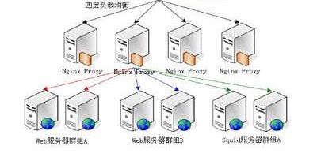
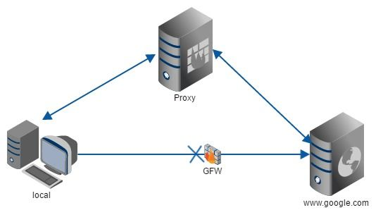
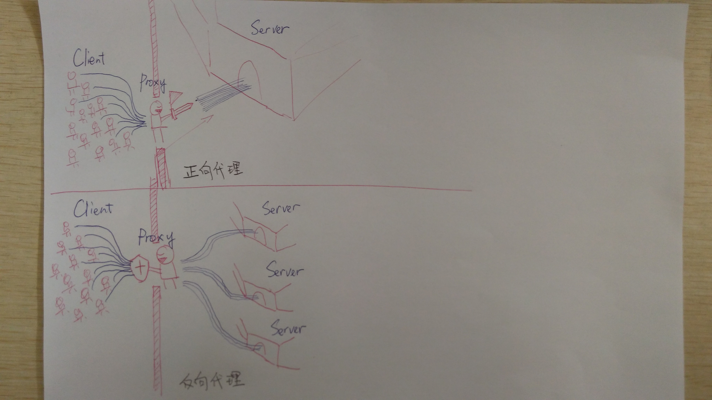

# Nginx

> 反向代理，即代理将来自外网client的请求forward到内网server，**从外到内**
>
> 正向代理代理客户端，反向代理代理服务器
>
> 

# 反向代理的实现

> 1）需要有一个负载均衡设备来分发用户请求，将用户请求分发到空闲的服务器上
>
> 2）服务器返回自己的服务到负载均衡设备
>
> 3）负载均衡将服务器的服务返回用户

即：用户和负载均衡设备直接通信，也意味着**用户做服务器域名解析时，解析得到的IP其实是负载均衡的IP，而不是服务器的IP**，这样有一个好处是，当新加入/移走服务器时，仅仅需要修改负载均衡的服务器列表，而不会影响现有的服务。

-----

**正向代理**

A同学在大众创业、万众创新的大时代背景下开启他的创业之路，目前他遇到的最大的一个问题就是启动资金，于是他决定去找马云爸爸借钱，可想而知，最后碰一鼻子灰回来了，情急之下，他想到一个办法，找关系开后门，经过一番消息打探，原来A同学的大学老师王老师是马云的同学，于是A同学找到王老师，托王老师帮忙去马云那借500万过来，当然最后事成了。不过马云并不知道这钱是A同学借的，马云是借给王老师的，最后由王老师转交给A同学。这里的王老师在这个过程中扮演了一个非常关键的角色，就是**代理**，也可以说是正向代理，王老师代替A同学办这件事，这个过程中，真正借钱的人是谁，马云是不知道的，这点非常关键。

我们常说的代理也就是只正向代理，正向代理的过程，它**隐藏了真实的请求客户端，服务端不知道真实的客户端是谁，客户端请求的服务都被代理服务器代替来请求**，某些科学上网工具扮演的就是典型的正向代理角色。用浏览器访问 http://www.google.com 时，被残忍的block，于是你可以在国外搭建一台代理服务器，让代理帮我去请求google.com，代理把请求返回的相应结构再返回给我。

**反向代理**

大家都有过这样的经历，拨打10086客服电话，可能一个地区的10086客服有几个或者几十个，你永远都不需要关心在电话那头的是哪一个，叫什么，男的，还是女的，漂亮的还是帅气的，你都不关心，你关心的是你的问题能不能得到专业的解答，你只需要拨通了10086的总机号码，电话那头总会有人会回答你，只是有时慢有时快而已。那么这里的10086总机号码就是我们说的**反向代理**。客户不知道真正提供服务人的是谁。

**反向代理隐藏了真实的服务端**，当我们请求 www.baidu.com 的时候，就像拨打10086一样，背后可能有成千上万台服务器为我们服务，但具体是哪一台，你不知道，也不需要知道，你只需要知道反向代理服务器是谁就好了，www.baidu.com 就是我们的反向代理服务器，反向代理服务器会帮我们把请求转发到真实的服务器那里去。**Nginx就是性能非常好的反向代理服务器，用来做负载均衡**。

两者的区别在于代理的对象不一样：**正向代理**代理的对象是客户端，**反向代理**代理的对象是服务端

-----

